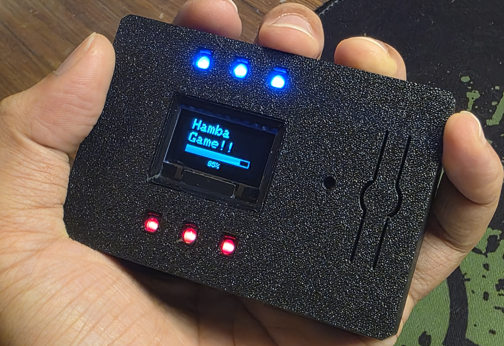

# Mini Gaming Console Using ESP32 LORA Display Module

I always wanted to design a gaming console as I was always fascinated by how gaming consoles blend hardware, software, and graphics. As I had one ESP32 based LORA (long-range) development board lying around, I thought of using that. This whole circuit works at 5V. The console works with only one button that can do multiple tasks. The firmware is upgradable, but for my initial project, I have added three cool games that are both fun to play and easy to code!

## Components used on this project
- 1 x Heltec ESP32 Lora display module [LINK](https://componentkini.com/product/heltec-esp32-lora-module-with-096-oled-display-v2)
- 1 x DC Active Buzzer [LINK](https://componentkini.com/product/dc-active-buzzer-5v-to-12v)
- 1 x Push Button [LINK](https://componentkini.com/product/tactile-momentary-push-button-switch-red)
- 2 x BC557 Transistor [LINK](https://componentkini.com/product/bc557-npn-transistor-to-92-10pcs)
- 5 x 1k resistor [LINK](https://componentkini.com/product/1k-ohm-14w-5-carbon-film-resistor-10pcs)
- 3 x Red LED [LINK](https://componentkini.com/product/oval-red-led-diode-38x5mm)
- 3 x Blue LED [LINK](https://componentkini.com/product/oval-blue-led-diode-38x5mm)
- 1 x 100 nF Capacitor [LINK](https://componentkini.com/product/01uf-50v-radial-electrolytic-capacitor-5pcs)

## About the project
The Motive is simple:
- This is a simple gaming console running on ESP32 with a built-in 0.96-inch OLED Display.
- The game, navigation, and play are all done by a single button.
- The built-in display on the ESP32 module acts as the screen.
- LEDs light up in various animations to show start/win/lose, etc.
- The buzzer sounds with varying frequency to generate different tones.
- Easy customization and firmware upgrade.

### The primary games:
- Hamba Match: In this game, an image moves continuously across the screen, and to win, you need to press at the correct time to embed the image in its outline.
- Hamba Run: I tried to recreate the dinosaur game you play on Chrome. Jump to avoid obstacles!
- Number Hold Game: In this game, a random number is shown on the display along with a continuously changing number. You need to press at the right time so that the continuous number exactly matches the random number.
- More Games: I will continue to add more simple and fun games to play on my GitHub. (link given below)

## Hardware and software
The 3d printed enclosure along with the detailed description of the code can be found at [my instructables account](https://www.instructables.com/Mini-Gaming-Console-Using-ESP32-LORA-Display-Modul/)

But,

Did you know you can CNC plastic? JLCCNC offers up to a 5-axis milling process! and all at a very low cost.
Big thanks to JLCCNC for supporting this project! They provide affordable and high-quality CNC machining services. Starting at just $1, click here to get the $70 coupons at JLCCNC: https://jlccnc.com/?from=alaminashik
